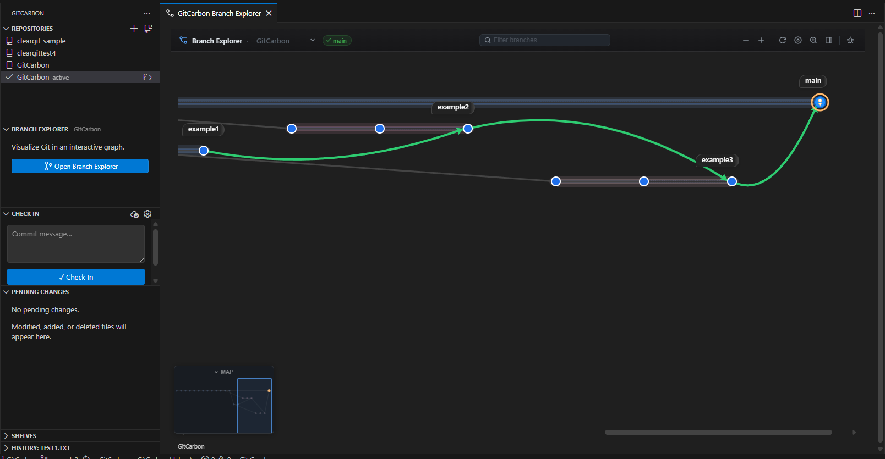
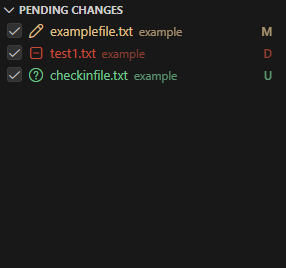

<p align="center">
  
</p>

<h1 align="center">GitCarbon</h1>

<p align="center">
  <strong>A simplified, deterministic Git workflow — built natively into VS Code.</strong><br />
  Plastic-style branch explorer &middot; One-press check-ins &middot; Single source of truth
</p>

<p align="center">
  <a href="https://marketplace.visualstudio.com/items?itemName=CPR.gitcarbon-vscode">
    
  </a>
  <a href="https://marketplace.visualstudio.com/items?itemName=CPR.gitcarbon-vscode">
    
  </a>
  <a href="https://github.com/hobomaan/GitCarbon/issues">
    
  </a>
  <a href="LICENSE">
    
  </a>
</p>

---

## The GitCarbon Philosophy

GitCarbon is built around five principles.

### 1️⃣ One Source of Truth  
Your repository history should reflect what actually happened.  
No ambiguity. No hidden structure.

### 2️⃣ No History Rewriting  
Rebase-heavy workflows introduce structural ambiguity and non-determinism.  
GitCarbon encourages merge-based clarity and preserved lineage.

### 3️⃣ Deterministic Workflows  
The same inputs should produce the same visible structure.  
No silent rewrites. No invisible rebases. No surprises.

### 4️⃣ Simplified Interaction  
Git should not require four commands to perform one action.  
GitCarbon reduces commit → push → pull complexity into intentional, unified operations.

Git is powerful — but it often feels more complicated than it needs to be.
Many developers don’t need to think about rebasing, local divergence, or multi-step sync flows just to work safely.

**GitCarbon keeps Git’s power while reducing the learning curve:
visual, simplified, predictable version control that stays out of your way.**

### 5️⃣ Low Learning Curve  
Version control should help developers ship code, not intimidate them.  
GitCarbon focuses on intuitive workflows so new developers can be productive quickly — without needing to master every Git concept first.

---

## Why GitCarbon?

Most Git tools either expose raw Git complexity or wrap it in interfaces that still assume deep Git knowledge.
GitCarbon brings the clarity of Plastic SCM’s branch explorer into VS Code — while simplifying how you interact with Git itself.

- **See the big picture** — interactive commit graph with colour-coded branch lanes and merge edges.
- **Act in context** — perform operations directly from the graph.
- **Check in with intention** — simplified, unified workflows.
- **Stay deterministic** — history remains consistent and trustworthy.
- **Stay in your editor** — everything lives in the VS Code sidebar.

---

### What Makes GitCarbon Different?

- **True left → right branch layout** — no spaghetti graphs  
- **Permanent branch ownership** — every commit belongs to exactly one branch, just like Plastic SCM  
- **Date range filtering** — view only recent history, from 3 months to all time, with custom date pickers  
- **Merge origin clarity** — always know where a branch came from  
- **One-press check-ins** — reduced multi-step Git flows  
- **Selective shelving** — stash only the files you choose, not the entire working tree  
- **Revert & tag awareness** — reverts and tags rendered distinctly without breaking the branch graph  
- **Ahead / behind tracking** — see remote sync status at a glance on every branch  
- **Deterministic-first design** — preserved, predictable history  

---

## Core Workflow Simplification

Traditional Git often looks like this:

```
git add
git commit
git push
git pull
resolve conflicts
repeat
```

GitCarbon turns that into structured, visible actions:

- **Check In** — stage, commit, and synchronise in a single intentional action  
- **Update** — controlled pull with visible merge context  
- **Merge from the graph** — drag-to-merge with explicit lineage  

Fewer steps.  
More visibility.  
No hidden state.

You shouldn’t need to memorise Git internals to work safely.
GitCarbon reduces cognitive overhead so developers can focus on code, not tooling.

---

## Features

### Branch Explorer (Commit Graph)

| Capability | Details |
|---|---|
| Interactive graph | Pan, zoom, colour-coded branch lanes, merge edges |
| Date range filter | Filter the graph by time period — presets (3 / 6 / 12 months, all) or custom from/to date pickers |
| Branch ownership | Commits permanently belong to one branch (Plastic SCM model) — deterministic, colour-coded lanes |
| Revert indicators | Revert commits are visually marked with a distinct colour on the graph |
| Tag-aware layout | Tags are rendered as purple badges without breaking branch structure or ownership |
| Tracking badges | Ahead / behind remote indicators (↑N / ↓N) on each branch label |
| Context menus | Checkout, merge, cherry-pick, revert, reset, rename, delete, compare, create tag, open on remote |
| Drag-to-merge | Trigger merges visually from branch to branch |
| Double-click actions | Double-click a node to view changeset details; double-click a branch label to list its changed files |
| Merge origin tracking | Clear visual lineage of branch ancestry |
| MiniMap | Bird's-eye navigation overlay with click-to-navigate |
| Commit search | Find commits by keyword from the header bar |
| Branch filter | Filter visible branches by name |
| Diff preview | Inline diff viewer for comparing any two commits |
| Keyboard navigation | Arrow keys to walk the graph; Home to centre on checked-out commit; +/− to zoom |
| Light & Dark themes | Follows VS Code theme automatically, or override with manual dark / light setting |

### Simplified Source Control

| Capability | Details |
|---|---|
| One-press Check In | Stage, commit, and push in a single unified action (Plastic SCM-style) |
| Selective staging | Only checked files are staged — checkbox model like Plastic SCM's Pending Changes |
| Pending Changes | Tree view with inline diff, discard, and conflict resolution actions |
| Pending changes badge | Live file count badge on the sidebar panel and on the HEAD node in the graph |
| Update (Pull) | Controlled fetch + pull from sidebar |
| Conflict resolution | Clear conflict file lists with abort options and direct access to VS Code's 3-way merge editor |
| Amend commit | Edit the last commit message directly from the detail pane |

### Repository Management

| Capability | Details |
|---|---|
| Multi-repo support | Auto-discovers Git repos in workspace; switch between repos from the sidebar or header dropdown |
| Initialise repository | Full flow: name → visibility → parent folder → `git init` → GitHub create → push |
| Clone repository | Browse GitHub / Azure DevOps repos, or paste a URL; auto-opens the cloned folder |
| Open in file explorer | Open any repo folder in the system file manager |

### Shelving (Stash)

| Capability | Details |
|---|---|
| Shelve Changes | Stash working tree (including untracked files) |
| Selective shelving | Shelve only checked files from Pending Changes (partial stash) |
| Unshelve / Apply / Drop | Full stash management from sidebar with badge count |
| Diff preview | Browse shelved file diffs before applying |

### History & Annotations

| Capability | Details |
|---|---|
| File History | Full commit history for any file with inline diffs (`--follow` for renames) |
| Blame Annotations | Toggle line-by-line blame annotations in the editor gutter with author, date, and commit summary |

### Pull Requests

| Capability | Details |
|---|---|
| Create PR | Open GitHub / GitLab / Azure DevOps / Bitbucket pull request from context menu |
| Open on remote | Jump to any commit on the remote hosting provider |

### Localisation

| Capability | Details |
|---|---|
| i18n framework | Full string externalisation — ready for community-contributed language packs |
| English (default) | 90+ keyed strings covering all context menus, tooltips, headers, and modals |

---

## Installation

1. Open VS Code  
2. Press `Ctrl+Shift+X`  
3. Search for **GitCarbon**  
4. Click **Install**

Or:

```
ext install CPR.gitcarbon-vscode
```

**Requirements**

- VS Code **1.60** or later  
- Git installed and available on `PATH`

---

## Quick Start

1. Open a Git repository.  
2. Click the **GitCarbon** icon in the Activity Bar.  
3. Explore your repository structure visually.  
4. Use **Check In** to commit and sync with a single action.

---

## Screenshots

| Branch Explorer | Pending Changes | Shelves |
|---|---|---|
|  |  |  |

---

## Roadmap

- [ ] Commit templates  
- [ ] Timeline view  
- [ ] Pull request review workflow  
- [ ] Team policies for deterministic workflows  
- [ ] Profiles & workspaces  

See `CONTRIBUTING.md` for guidelines.

---

## License

GitCarbon is proprietary software. Copyright (c) 2025–2026 CPR (Pittroche Ltd). All rights reserved.

Source code is provided for reference and transparency only — visibility does **not** constitute a grant of any license rights. See the [LICENSE](LICENSE) file for full terms.

The compiled extension is available via the [VS Code Marketplace](https://marketplace.visualstudio.com/items?itemName=CPR.gitcarbon-vscode).

---

<p align="center">
  History is the source of truth.<br />
  <strong>GitCarbon keeps it clear, simple, and trustworthy.</strong><br />
  <em>Version control shouldn’t be complicated.</em>
</p>